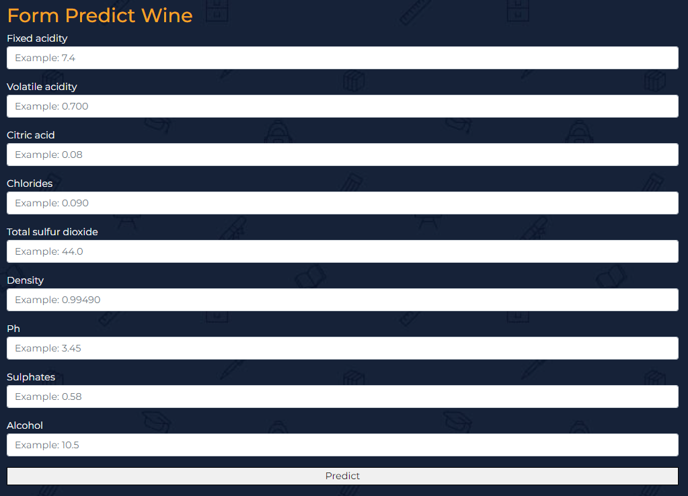
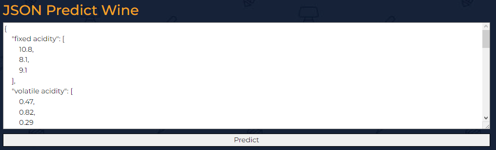
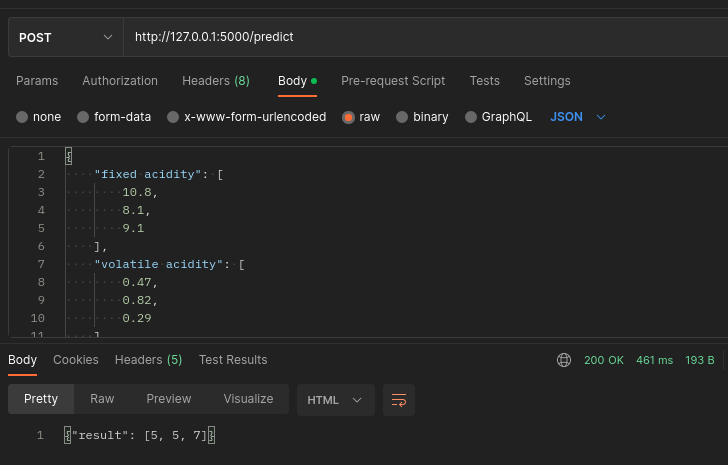

# IA-ApiRest
## Web Api Rest with Flask and Python

This project is a simple example of how to use a model to predict wine quality. The model was trained with the dataset [Wine Quality](https://www.kaggle.com/uciml/red-wine-quality-cortez-et-al-2009) from Kaggle. The model was trained with the `kNN` algorithm. The model was saved in a file with the extension `.pkl` and the file is loaded in the project.

## Requirements
- Principal
    - Python 3.10
    - Flask (framework)
    - Pickle (to load the model)

- Dependencies
    - Pandas 
    - Numpy
    - Scikit-learn (sklearn)
 
## Three Ways to Predict Wine Quality
- Form by types

    

- Form by json
  
    
- Request json in body
  
  With Postman
    